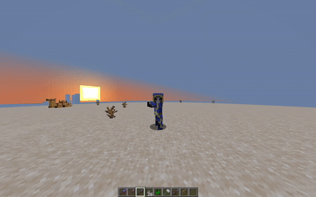
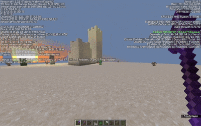
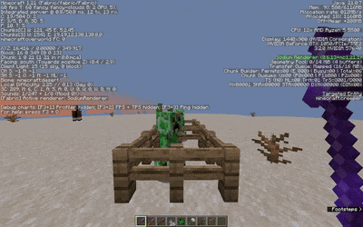

> **Language:** Русский · [English](README.en.md)

# Spears (Minecraft 1.21.4 Fabric Port)


Порт и обновление мода **Spears** (Backported Spears) для **Minecraft 1.21.4 (Fabric)**.

Источник: [GitHub: Unknowneth/Backported-Spears](https://github.com/Unknowneth/Backported-Spears).

---

## О моде

**Spears** добавляет в игру полноценный класс оружия — **копья** (деревянные, каменные, медные, железные, золотые, алмазные и незеритовые) с уникальными механиками атаки.

---

## Галерея

| Бой и выпад | Атака с разгона (Charge) | Пронзание врагов |
|:---:|:---:|:---:|
|  |  |  |

---

## Возможности

- **Увеличенная дистанция атаки (Reach)**: копья позволяют атаковать противников на увеличенной дистанции (2.0 – 4.5 блока).
- **Атака с разгона (Charge Attack)**: зажатие правой кнопки мыши переводит копье в боевую стойку разгона; урон и отбрасывание зависят от скорости движения игрока или верхового животного (лошади), а также сбивают противников со скакунов.
- **Выпад (Stab & Lunge)**: уникальная колющая анимация удара и специальные звуковые эффекты.
- **Зачарования**: поддержка зачарований и интеграции с боевой системой.

---

## Что изменено в порте для 1.21.4 (byMr712)

- **Полная миграция на Minecraft 1.21.4 (Fabric Loader)**:
  - Оптимизированная чистая Fabric-структура проекта (Fabric Loom 1.10.1, Yarn `1.21.4+build.7`, Java 21 LTS).
  - Адаптация боевой логики и регистрации предметов под API и реестры 1.21.4 (`ToolMaterial`, `EntityAttributes.ATTACK_DAMAGE`, `ActionResult`).
  - Обновление сетевого протокола (CustomPayload / PayloadTypeRegistry) и условий лута под `LootWorldContext`.
  - Адаптация рендеринга и анимаций под архитектуру `BipedEntityRenderState` и `ItemDisplayContext`.
- **Клиентские определения предметов (Client Item Definitions)**:
  - Добавлены `assets/minecraft/items/*.json` со селектором `minecraft:display_context` для идеального отображения плоских 2D-иконок в GUI/инвентаре и объемных 3D-моделей копий в руке.
- **Полная локализация**:
  - Добавлены русская (`ru_ru.json`) и английская (`en_us.json`) локализации для всех копий, звуковых субтитров, зачарований и достижений.

---

## Установка

1. Скачайте последнюю версию со страницы [GitHub Releases](https://github.com/byMr712/Spears-1.21.4-MinecraftMod/releases).
2. Требуются:
   - [Fabric API](https://modrinth.com/mod/fabric-api)
3. Поместите `.jar` файл в папку `mods`.
4. Запустите игру.

---

## Сборка

1. Требуется Java 21 и Fabric Loader для Minecraft 1.21.4.
2. Для сборки выполните:
   ```bash
   ./gradlew build
   ```
3. Собранный файл находится в `build/libs/Spears-1.21.4-byMr712.jar`.

---

## Авторы и лицензия

- Оригинальный автор: [Unknowneth](https://github.com/Unknowneth) ([Backported-Spears](https://github.com/Unknowneth/Backported-Spears)).
- Порт и адаптация для 1.21.4: [Mr712](https://github.com/byMr712).
- Распространяется под лицензией [Apache License 2.0](LICENSE).
